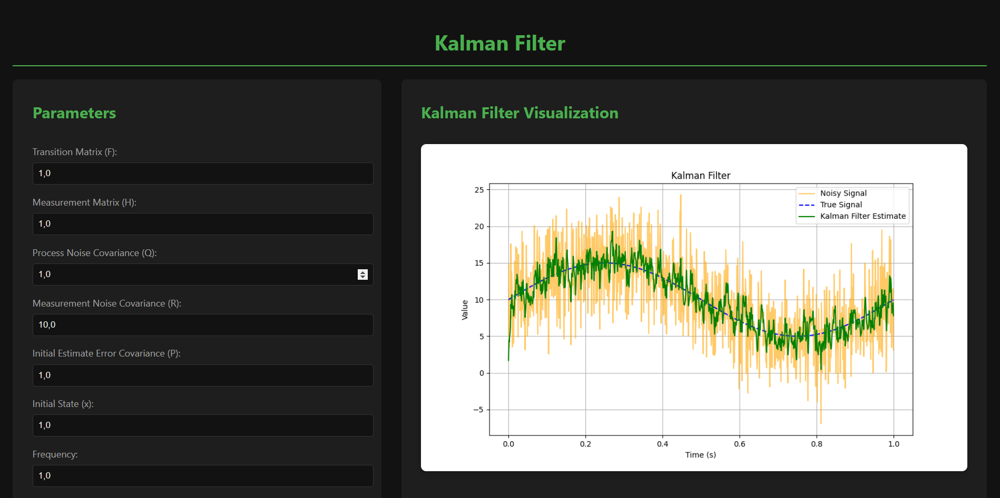
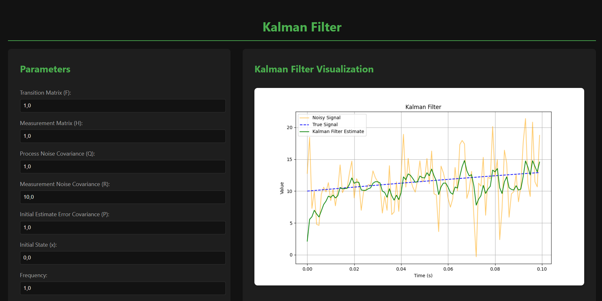

#Лабораторна робота №7. Дослідження фільтра Калмана</h1>

## Ознайомитись з кодом програми можливо у файлі "app.py"

###<b>Мета роботи:</b>
<ol>
    <li>Ознайомитися з роботою фільтра Калмана та принципами його застосування.</li>
    <li>Вивчити вплив різних параметрів фільтра на результати згладжування сигналу.</li>
    <li>Навчитися аналізувати результати фільтрації, враховуючи значення дисперсії шуму до та після фільтрації.</li>
</ol>

<p>
    <b>Основне завдання:</b>
</p>
<ol>
    <li>
        <b>Ініціалізація коду:</b>
        <ul>
            <li>Використайте код, що наданий у розділі "Теоретичні відомості", як базовий шаблон.</li>
            <li>Переконайтеся, що всі параметри фільтра Калмана (F, H, Q, R, P, x) задані правильно та відповідають початковому варіанту.</li>
        </ul>
    </li>
    <li>
        <b>Дослідження впливу параметрів:</b>
        Послідовно змінюйте значення кожного з наступних параметрів фільтра Калмана:
        <ul>
            <li>Матриця коваріації шуму процесу (Q): збільшуйте та зменшуйте значення, аналізуйте, як це впливає на передбачення.</li>
            <li>Матриця коваріації шуму вимірювання (R): змініть цей параметр, щоб побачити, як фільтр реагує на зміну довіри до вимірювань.</li>
            <li>Початкова матриця коваріації (P): експериментуйте з різними початковими невпевненостями щодо стану.</li>
            <li>Початкова оцінка стану (Initial state estimate): спробуйте різні початкові значення та простежте, як це впливає на збіжність фільтра.</li>
            <li>Постійна складова сигналу (offset): змініть зсув сигналу, щоб оцінити, наскільки фільтр адаптується до зміщеного сигналу.</li>
            <li>Загальний час моделювання (total_time): для фільтрацій із дуже інерційними параметрами, змініть загальний час симуляції, щоб переконатися, що фільтр встигає "налаштуватися" та стабілізувати свої результати.</li>
        </ul>
    </li>
    <li>
        <b>Порівняння результатів:</b>
        Для кожної комбінації параметрів:
        <ul>
            <li>Розрахуйте дисперсію шуму до фільтрації та після фільтрації.</li>
            <li>Створіть графік, що показує результати фільтрації у порівнянні з реальним сигналом та шумним сигналом.</li>
            <li>Зробіть скріншоти кожного графіка та додайте їх у звіт.</li>
        </ul>
    </li>
    <li>
        <b>Аналіз та висновки:</b>
        <ul>
            <li>Зафіксуйте значення дисперсії шуму до і після фільтрації.</li>
            <li>Для кожного випадку фільтрації прокоментуйте результати.</li>
            <li>Поясніть, як зміна конкретного параметра вплинула на передбачення, корекцію стану та зміну дисперсії.</li>
            <li>Сформулюйте загальні висновки щодо поведінки фільтра Калмана при різних комбінаціях параметрів.</li>
        </ul>
    </li>
</ol>

<h2>Реалізація фільтру Калмана</h2>

<p>Код побудований на Python з використанням бібліотек Flask, NumPy та Matplotlib.</p>

<p>Код складається з кількох основних частин. Інтерфейс користувача забезпечує введення параметрів фільтра через форму, яка інтерактивно оновлюється залежно від даних користувача. Готовий інтерфейс дозволяє швидко змінювати параметри та візуалізувати результати.</p>

<p>Клас <code>KalmanFilter</code> реалізує основну логіку роботи фільтра. Метод <code>predict()</code> передбачає наступний стан системи, враховуючи попередній стан і матрицю переходу, а <code>update(z)</code> оновлює стан на основі нового вимірювання та обчислює коефіцієнт Калмана для зменшення невизначеності.</p>

<p>Симуляція сигналу включає моделювання реального сигналу у вигляді синусоїди із заданими параметрами (частота, амплітуда, зсув), до якого додається шум для перевірки ефективності фільтрації в умовах завад. Візуалізація реалізується через графіки, які показують шумний сигнал, реальний сигнал та оцінки фільтра. Ці графіки зберігаються у вигляді зображень і передаються у веб-інтерфейс.</p>

<p><b>Код реалізації фільтру Калмана:</b></p>

``` python
from flask import Flask, request, render_template_string
import numpy as np
import matplotlib.pyplot as plt
import io
import base64

app = Flask(__name__)

HTML_TEMPLATE = """
<!DOCTYPE html>
<html lang="en">
<head>
    <meta charset="UTF-8">
    <meta name="viewport" content="width=device-width, initial-scale=1.0">
    <title>Kalman Filter</title>
    <style>
        :root {
            --bg-primary: #121212;
            --bg-secondary: #1E1E1E;
            --text-primary: #E0E0E0;
            --text-secondary: #A0A0A0;
            --accent-color: #4CAF50;
            --border-color: #333;
        }

        body {
            font-family: system-ui, -apple-system, BlinkMacSystemFont, 'Segoe UI', Roboto, Oxygen, Ubuntu, Cantarell, 'Open Sans', 'Helvetica Neue', sans-serif;
            background-color: var(--bg-primary);
            color: var(--text-primary);
            line-height: 1.6;
            margin: 0;
            padding: 20px;
        }

        .container {
            display: flex;
            gap: 30px;
            justify-content: center;
            align-items: flex-start;
            margin: 0 auto;
        }

        .sidebar {
            flex: 1;
            max-width: 500px;
            background-color: var(--bg-secondary);
            padding: 30px;
            border-radius: 8px;
            box-shadow: 0 4px 6px rgba(0,0,0,0.1);
        }

        .results {
            flex: 1.5;
            background-color: var(--bg-secondary);
            padding: 30px;
            border-radius: 8px;
            box-shadow: 0 4px 6px rgba(0,0,0,0.1);
            min-height: 100px; 
            box-sizing: border-box;
        }

        h1 {
            text-align: center;
            color: var(--accent-color);
            border-bottom: 2px solid var(--accent-color);
            padding-bottom: 10px;
            margin-bottom: 20px;
        }
        
        h2 {
            color: var(--accent-color);
            padding-bottom: 10px;
            margin-bottom: 20px;
            margin-top: 0px;
        }

        form {
            display: grid;
            gap: 15px;
        }

        label {
            display: block;
            color: var(--text-secondary);
            font-size: 0.9em;
        }

        input {
            width: 100%;
            padding: 8px;
            margin-top: 5px;
            background-color: var(--bg-primary);
            border: 1px solid var(--border-color);
            color: var(--text-primary);
            border-radius: 4px;
            transition: border-color 0.3s ease;
        }

        input:focus {
            outline: none;
            border-color: var(--accent-color);
        }

        button {
            width: 100%;
            padding: 12px;
            background-color: transparent;
            color: var(--accent-color);
            border: 2px solid var(--accent-color);
            border-radius: 6px;
            cursor: pointer;
            font-weight: medium;
            transition: all 0.3s ease;
            margin-top: 15px;
            text-transform: uppercase;
            letter-spacing: 0.05em;
        }

        button:hover {
            background-color: var(--accent-color);
            color: var(--bg-primary);
        }

        .results img {
            max-width: 100%;
            height: auto;
            display: block;
            margin: 20px auto;
            border-radius: 8px;
            box-shadow: 0 4px 10px rgba(0,0,0,0.2);
        }

        .results p {
            background-color: var(--bg-primary);
            padding: 10px;
            border-radius: 4px;
            margin: 10px 0;
        }

        @media (max-width: 768px) {
            .container {
                flex-direction: column;
            }
            
            .sidebar, .results {
                width: 100%;
            }
        }
    </style>
</head>
<body>
    <h1>Kalman Filter</h1>
    <div class="container">
        <div class="sidebar">
            <h2>Parameters</h2>
            <form method="post">
                <label>Transition Matrix (F): <input type="number" name="F" step="0.1" value="{{ F }}"></label>
                <label>Measurement Matrix (H): <input type="number" name="H" step="0.1" value="{{ H }}"></label>
                <label>Process Noise Covariance (Q): <input type="number" name="Q" step="0.1" value="{{ Q }}"></label>
                <label>Measurement Noise Covariance (R): <input type="number" name="R" step="0.1" value="{{ R }}"></label>
                <label>Initial Estimate Error Covariance (P): <input type="number" name="P" step="0.1" value="{{ P }}"></label>
                <label>Initial State (x): <input type="number" name="x" step="0.1" value="{{ x }}"></label>
                <label>Frequency: <input type="number" name="frequency" step="0.1" value="{{ frequency }}"></label>
                <label>Amplitude: <input type="number" name="amplitude" step="0.1" value="{{ amplitude }}"></label>
                <label>Offset: <input type="number" name="offset" step="0.1" value="{{ offset }}"></label>
                <label>Sampling Interval: <input type="number" name="sampling_interval" step="0.001" value="{{ sampling_interval }}"></label>
                <label>Total Time: <input type="number" name="total_time" step="0.1" value="{{ total_time }}"></label>
                <label>Noise Variance: <input type="number" name="noise_variance" step="0.1" value="{{ noise_variance }}"></label>
                <button type="submit">Run Kalman Filter</button>
            </form>
        </div>
        
        
        <div class="results">
            <h2>Kalman Filter Visualization</h2>
            
        </div>
        
    </div>
</body>
</html>
"""

class KalmanFilter:
    def __init__(self, F, H, Q, R, P, x):
        self.F = F
        self.H = H
        self.Q = Q
        self.R = R
        self.P = P
        self.x = x

    def predict(self):
        self.x = np.dot(self.F, self.x)
        self.P = np.dot(self.F, np.dot(self.P, self.F.T)) + self.Q
        return self.x

    def update(self, z):
        K = np.dot(self.P, self.H.T) / (np.dot(self.H, np.dot(self.P, self.H.T)) + self.R)
        self.x = self.x + K * (z - np.dot(self.H, self.x))
        self.P = (np.eye(len(self.P)) - K * self.H) @ self.P
        return self.x


@app.route('/', methods=['GET', 'POST'])
def index():
    # Default parameters
    params = {
        "F": 1.0,
        "H": 1.0,
        "Q": 1.0,
        "R": 10.0,
        "P": 1.0,
        "x": 0.0,
        "frequency": 1.0,
        "amplitude": 5.0,
        "offset": 10.0,
        "sampling_interval": 0.001,
        "total_time": 1.0,
        "noise_variance": 16.0,
    }

    plot_url = None

    if request.method == 'POST':
        # Update parameters from user input
        for key in params.keys():
            params[key] = float(request.form.get(key, params[key]))

        # Extract parameters
        F = np.array([[params["F"]]])
        H = np.array([[params["H"]]])
        Q = np.array([[params["Q"]]])
        R = np.array([[params["R"]]])
        P = np.array([[params["P"]]])
        x = np.array([[params["x"]]])
        frequency = params["frequency"]
        amplitude = params["amplitude"]
        offset = params["offset"]
        sampling_interval = params["sampling_interval"]
        total_time = params["total_time"]
        noise_variance = params["noise_variance"]

        # Kalman filter setup
        kf = KalmanFilter(F, H, Q, R, P, x)

        # Signal generation
        time_steps = np.arange(0, total_time, sampling_interval)
        true_signal = offset + amplitude * np.sin(2 * np.pi * frequency * time_steps)
        noise_std_dev = np.sqrt(noise_variance)
        noisy_signal = [val + np.random.normal(0, noise_std_dev) for val in true_signal]

        # Apply Kalman Filter
        kalman_estimates = []
        for measurement in noisy_signal:
            kf.predict()
            estimate = kf.update(measurement)
            kalman_estimates.append(estimate[0][0])

        # Generate plot
        plt.figure(figsize=(10, 6))
        plt.plot(time_steps, noisy_signal, label='Noisy Signal', color='orange', alpha=0.6)
        plt.plot(time_steps, true_signal, label='True Signal', linestyle='--', color='blue')
        plt.plot(time_steps, kalman_estimates, label='Kalman Filter Estimate', color='green')
        plt.xlabel('Time (s)')
        plt.ylabel('Value')
        plt.title('Kalman Filter')
        plt.legend()
        plt.grid()

        # Save plot to a bytes buffer
        buffer = io.BytesIO()
        plt.savefig(buffer, format='png')
        buffer.seek(0)
        plot_url = base64.b64encode(buffer.read()).decode('utf-8')
        buffer.close()

    return render_template_string(
        HTML_TEMPLATE, **params,
        plot_url=plot_url,
    )


if __name__ == "__main__":
    app.run(debug=True)
```

<p align="center">  </p>

<h2>Дослідження впливу параметрів</h2>

<ol>
    <li>
        <h3>Матриця коваріації шуму процесу (Process Noise Covariance (Q)):</h3>
        <p>Цей параметр визначає рівень довіри до моделі процесу. Збільшення Q робить фільтр більш гнучким, дозволяючи швидше реагувати на зміни в системі. (Q = 100,0)</p>
        <p align="center">  </p>
        <p>У разі надто великого Q фільтр може перестати ефективно згладжувати шум, а при малих значеннях Q знижується чутливість до змін сигналу. (Q = 0,1)</p>
        <p align="center">  </p>
    </li>
    <li>
        <h3>Матриця коваріації шуму вимірювання (Measurement Noise Covariance (R)):</h3>
        <p>Відповідає за довіру до вимірювань. Високі значення R означають, що фільтр більше покладається на передбачення, ніж на вимірювання. (R = 100,0)</p>
        <p align="center">  </p>
        <p>За низького R фільтр надає перевагу вимірюванням, що може призводити до чутливості до шумів у даних. (R = 1,0)</p>
        <p align="center">  </p>
    </li>
    <li>
        <h3>Початкова матриця коваріації (Initial Estimate Error Covariance (P)):</h3>
        <p>Визначає початкову невпевненість у стані системи. Високе значення P може призвести до тривалого процесу збіжності. (P = 100,0)</p>
        <p align="center">  </p>
        <p>Низькі значення P прискорюють збіжність, але можуть бути недостатньо точними на початкових етапах. (P = 0,1)</p>
        <p align="center">  </p>
    </li>
    <li>
        <h3>Початкова оцінка стану (Initial State (x)):</h3>
        <p>Впливає на перші ітерації роботи фільтра. Якщо початкове значення значно перевищує реальний стан, це може спричинити уповільнення збіжності та збільшення початкової похибки. (x = 50,0)</p>
        <p align="center">  </p>
        <p>Зменшення початкового значення x, якщо воно ближче до реального стану, дозволяє швидше стабілізуватися результатам. (x = 1,0)</p>
        <p align="center">  </p>
    </li>
    <li>
        <h3>Постійна складова сигналу (Offset):</h3>
        <p>Визначає базовий рівень сигналу. Збільшення постійної складової сигналу призводить до зміщення середнього рівня сигналу вгору, і фільтр демонструє здатність адаптуватися до нового середовища. (Offset = 100,0)</p>
        <p align="center">  </p>
        <p>Зменшення викликає зсув середнього рівня сигналу вниз. Фільтр також може адаптуватися до цих змін, але при значних зменшеннях параметрів можуть виникати помітні затримки в стабілізації результатів. (Offset = 1,0)</p>
        <p align="center">  </p>
    </li>
    <li>
        <h3>Загальний час моделювання (Total Time):</h3>
        <p>Визначає тривалість симуляції сигналу. Збільшення часу моделювання дозволяє спостерігати довготривалу стабільність фільтра та його поведінку при різних змінах сигналу. (Total Time = 10,0)</p>
        <p align="center">  </p>
        <p>Скорочення часу моделювання може призвести до недостатнього періоду для адаптації фільтра, що ускладнює аналіз короткотермінових змін. (Total Time = 0,1)</p>
        <p align="center">  </p>
    </li>
</ol>

<p><h3>Висновок:</h3> Фільтр Калмана ефективно згладжує шумний сигнал, забезпечуючи високу точність при правильному налаштуванні параметрів. Вибір матриць Q та R є ключовим для досягнення балансу між адаптивністю та стабільністю фільтра. Початкові значення P та x значно впливають на швидкість збіжності, хоча їх вплив зменшується після декількох ітерацій. Результати показують, що фільтр може адаптуватися до зміщеного сигналу та стабілізувати оцінки навіть у складних умовах з високим рівнем шуму.</p>

